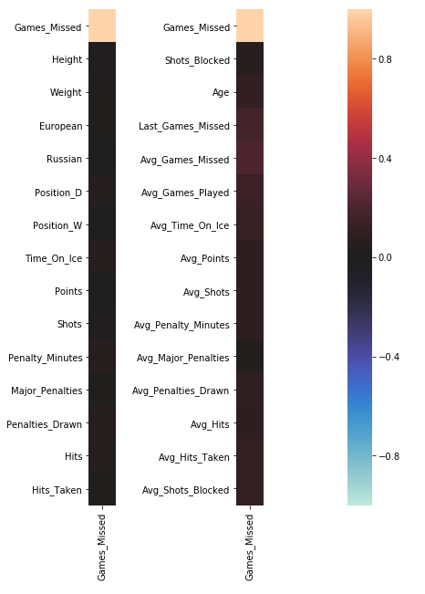
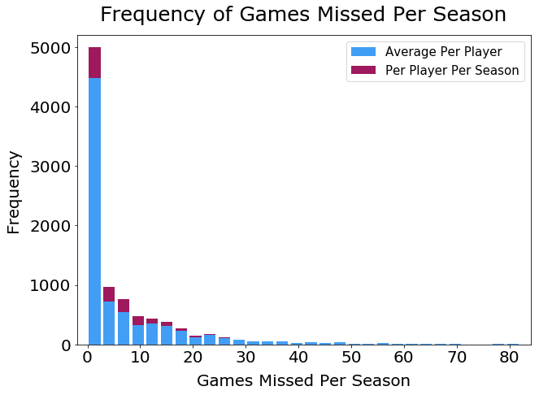
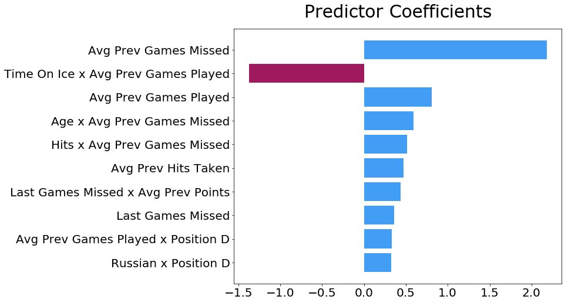

# Predicting NHL Injuries

I attempted to build a model capable of predicting how many games an NHL player will miss in a season due to injury. I’m a huge fan of both hockey and its associated analytics movement, so I wanted to work with NHL data but I also wanted to find a relatively uncovered angle. I also wanted to put some of the conventional wisdom of the league to the test:
* Do smaller/lighter players get injured more?
* Is being injury-prone a real thing?
* Are older players more likely to get hurt?
* Are players from certain countries more or less likely to get injured? (ie, "soft" Europeans and Alex Ovechkin's "Russian machine never breaks" quote)

### Data Collection

Counting stats for sports are easy to come by and hockey is no different - I was able to download CSVs of all player stats and biometrics for the last ten NHL seasons from [**Natural Stat Trick**](https://www.naturalstattrick.com). I combined the separate NST datasets in [**the 'player_nst_data' notebook**](work/player_nst_data.ipynb). Unfortunately reliable player injury histories are much more difficult to come by. I was able to scrape lists of injuries from individual player profiles from [**TSN**](https://www.tsn.ca/nhl) using Selenium and BeautifulSoup. All injury scraping and parsing is contained in [**the 'player_injury_data' notebook**](work/player_injury_data.ipynb). While I don't believe the TSN data is an exhaustive list of player injuries it is the best I could find so that's what I used.

### Feature Selection/Engineering

Mostly due to the amazing amount of counting stats Natural Stat Trick aggregates, I had an abundance of potential features for my models. I mostly used my domain knowledge as a longtime hockey fan to whittle down the list to anything I thought could correlate with injury rates, as well as predictors to test the conventional wisdom of what causes players to get hurt. I also removed goaltenders from my data set because their counting stats are completely different from those of other skaters. One of my models utilized sklearn's polynomial features to account for any feature interaction. Here is a partial list of individual features and my logic for choosing them:
* **Games Missed Due to Injury:** what I'm trying to predict
* **Height/Weight:** to see if smaller/lighter players get injured more often
* **Position:** defensemen play more minutes and are more likely to block shots than other positions, wingers and defensemen are more likely than centers to engage in checking along the boards
* **Penalties Drawn:** penalties are often assessed when a player is injured as the result of a dangerous and illegal play
* **Hits Delivered/Hits Taken:** an indicator of physical play that could lead to more injuries
* **Shots Blocked:** players sometimes suffer contusions and break bones blocking shots
* **Age:** to see if older players get injured more often
* **Major Penalties:** majors are often assessed for fighting
* **Being European/Being Russian:** to see if either correlates with increased injury rates

### Additional Feature Engineering

I started off with some simple models because I wanted to evaluate what formulation of my data would work best before spending my time tweaking hyperparameters. I fit an Ordinary Least Squares regression on each of the following data sets:
* Each entry contains the total counting stats and games missed due to injury for the last ten seasons.
* Each entry contains the counting stats, games missed due to injury, and games missed last season for a single season for a player. In this and the following format, players can have multiple rows of data.
* Similar to the last format except it includes rolling averages of counting stats and games missed for all previous seasons.

I created each of these data formulations in [**the 'data_merge' notebook**](work/data_merge.ipynb). Unsurprisingly, the last and most robust data set resulted in the lowest test MSE so I used that formulation of my data for the final modeling. All modeling lives in [**the 'nhl_injuries' notebook**](nhl_injuries.ipynb).

### EDA

Exploratory Data Analysis confirmed some of my assumptions going in - mainly that injuries are largely random and unpredictable. The heatmap below shows very low correlation between any of my predictors and the response.  

  

I also created a histogram of games missed due to injury per season (second graph below) that shows most players miss little or no time. As a result the distribution of games missed has an extreme right skew.  

  

### Models

Before training my final models I limited the data set to only players who had played at least 50 career games, which mainly removed career minor league players who have spotty NHL statistics. I standard-scaled all values, created a test/train split of my data set of 7,851 player-seasons, and trained a **Lasso linear regression model** with polynomial features and a **random forest regressor model**. The test R2 values for both models were both low, indicating that the predictors did not explain much of the variation in the response in either model.

| Model         | R2 |
| ------------- | ------------- |
| Lasso         | 0.075         |
| Random Forest | 0.107         |

### Results

Since the Lasso model performed similarly to the random forest model while maintaining greater interpretability, I used it for all subsequent analysis. I graphed the ten most important predictors for the Lasso model along with their coefficient values. Although the model didn't have great predictive value I still wanted to determine which inputs had the most influence.

Using the chart above I was able to get some answers to my initial questions:
* Height and weight don't appear anywhere near the top of the predictor list, meaning my model finds no evidence that smaller or lighter players get hurt more
* Average Previous Games Missed and Last Games Missed appear frequently in the top 10, lending some credence to the some players being injury-prone
* Age times Average Previous Games Missed is the fourth-highest predictor coefficient, providing some very weak evidence of older players being more likely to get injured
* Nationality appears to have almost no importance to the model, save for Russian defencemen having a small positive correlation with games missed due to injury

### Conclusions

In many ways the results of this project confirmed my pre-existing beliefs, especially that NHL injuries are largely random events that are difficult to neatly capture in a model. Because I started off assuming a model would not have great predictive quality, I felt obligated to create the best model I could to account for my bias. I also expected to find little to no evidence of players being injury prone, but my model presents evidence that players injured in the past are more likely to get hurt in the future. While I still believe injuries are too random to be reliably predicted by a model, I do think my model can be improved upon with more and better data. More complete NHL and minor league injury data would fill a lot of gaps in the model, especially for players who are not NHL stalwarts. New NHL player tracking data could potentially provide input values with far more predictive value than traditional counting stats. I'm excited to see what future insights can be gleaned as we continue to collect increasingly more detailed sports data.
